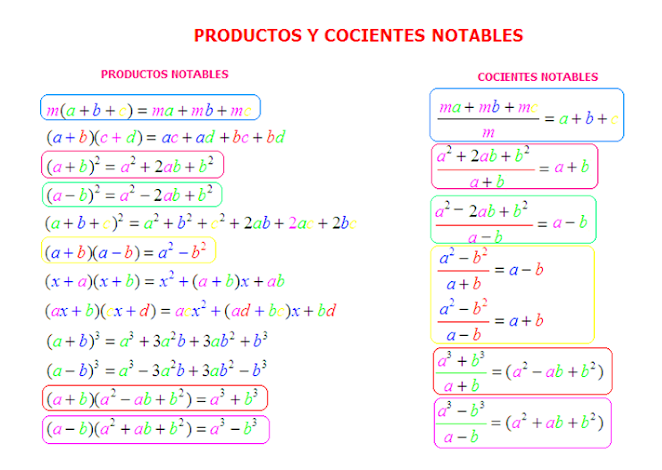

# Expresiones Algebraicas

**Tema de la clase** Condiciones de divisibilidad y cocientes notables.

**Objetivo de la clase**  Definir y resolver ejercicios aplicando cocientes notables.  

## Divisibilidad de $x^n ± a^n$ entre $x ± a$ 

Se analizara las condiciones para que $P(x)=x^n ± a^n$ sea divisible por $x ± a$.

Por el Teorema del Resto sabemos que $P(x)$ es divisible por $x +a$ si $P(-a)=0$ y de igual forma si  $x - a$ si $P(a)=0$.

1. $x^n - a^n$ siempre es divisible por $x-a$. En efecto cualquiera que sea n, $P(a)=a^n-a^n=0$

    Por lo tanto el cociente es:

    $\left(\dfrac{x^n - a^n}{x-a}\right)=x^{n-1}+ax^{n-2}+a^2x^{n-3}+...+a^{n-3}x^{2}+a^{n-2}x +a^{n-1}$

2. $x^n + a^n$ siempre es divisible por $x-a$. En efecto cualquiera que sea n, $P(a)=a^n+a^n=2a^n≠0$

3. $x^n - a^n$ es divisible por $x+a$. Si $n$ es par.En efecto, si $n$ es par tenemos: $P(-a)=(a-)^n-a^n=a^n-a^n=0$

    Por lo tanto el cociente es:

    $\left(\dfrac{x^n - a^n}{x+a}\right)=x^{n-1}-ax^{n-2}+a^2x^{n-3}+...-a^{n-3}x^{2}+a^{n-2}x -a^{n-1}$

    En cambio si n es impar: 

    $P(-a)=(-a)^n-a^n=-2a^n≠0$

4. $x^n + a^n$ es divisible por $x+a$. Si $n$ es impar.En efecto, si $n$ es impar tenemos: $P(-a)=(-a)^n+a^n=-a^n+a^n=0$

    Por lo tanto el cociente es:

    $\left(\dfrac{x^n + a^n}{x+a}\right)=x^{n-1}+ax^{n-2}+a^2x^{n-3}+...+a^{n-3}x^{2}+a^{n-2}x +a^{n-1}$

    En cambio si n es par: 

    $P(-a)=(-a)^n+a^n=a^n+a^n=2a^n≠0$

## Cocientes Notables

Son productos notables expresados como cocientes cuyo resultado se puede determinar directamente, lo mas comunes son: 

Al igual que productos notables, los cocientes notables son formulas que se puede utilizar para suprimir operaciones (división de polinomios).

### Ejemplos 

- Efectuar los siguientes cocientes:

1. $\left(\dfrac{125- 343x^{15}}{5-7x^5}\right)$

- Aplicamos:     $\left(\dfrac{a^3- b^3}{a-b}\right)=(a^2+ab+b^2)$

    $\left(\dfrac{125- 343x^{15}}{5-7x^5}\right)=5^2+(5)(7x^5)+(7x^5)^2$

    $\left(\dfrac{125- 343x^{15}}{5-7x^5}\right)=25+ 35 x^5+ 49x^{10}$

 Se puede aplicar cualquier metodo de divisón. En este se escoje utlizar el algoritmo de divisón para comprobar que cocientes notables son formulas para simplificar procedimiento.

- Aplicando el algoritmo de Division 

    $P(x)=D(x).Q(x)+R(x)$

    $125- 343x^{15}= (5-7x^5) Q(x)+R(x)$

    Realizaremos un cambio de variable y por definicion de cocientes notables el $R(x)=0$.

    $x^5=y$ y $R(y)=0$.

    Entonces:
    
    $125- 343y^{3}= (5-7y) Q(y)$

    $P(y)=125- 343y^{3}$

    $G.P(y)=3$ ; Grado 3

    $D(y)=(5-7y)$ 

    $G.D(y)=1$ ; Grado 1

    $G.Q(y)=G.P(y)- G.D(y)$
    
    $G.Q(y)=3-1=2$ ; Grado 2

    Por lo tanto

    $Q(y)=Ay^2+By+C$ 

    Entonces

     $125- 343y^{3}= (5-7y) (Ay^2+By+C)$  

    Realizamos la multiplicacion.

    $125- 343y^{3}= 5Ay^2+5By+5C-7Ay^3-7By^2-7Cy$

    Agrupamos terminos semejantes
    
    $125- 343y^{3}= 5C+ (5B-7C)y + (5A-7B) y^2 -7Ay^3$

    Igualamos lo coeficientes de los terminos de igual grado, es decir:

    |  Termino|Coeficiente|  Polinomio de coeficientes interminados|Valores correspondientes|
    |:--:|:---:|:--:|:--:|
    |  $x^3$|$-343$|  $-7A$| $-7A=-343$   $A=49$|
    |  $x^2$|$0$|  $5A-7B$|  $5A-7B=0$  $B=\frac{5A}{7}$  $B=35$|
    |  $x$|$0$| $5B-7C$| $5B-7C$  $C=\frac{5B}{7}$  $C=25$|
    |  $x^0$|$125$|  $5C$| $5C=125$ $C=25$ |

    Por lo tanto se reemplaza los valores obtenidos en $Q(y)$  

    $Q(y)=Ay^2+By+C$ 

    $Q(y)=49y^2+35y+25$ 

    Reemplazamos el valor de $y=x^5$
    
    Resultado

    $Q(x)=49x^{10}+35x^5+25$; Comprobamos que se obtiene el mismo resultado.

2.  $\left(\dfrac{(a+b)^{3}+(c+d)^{3}}{(a+b)^{2}-(a+b)(c+d)+(c+d)^{2}}\right)$

- Aplicamos: $\left(\dfrac{a^3+ b^3}{a+b}\right)=(a^2-ab+b^2)$
    
    Despejamos ${a+b}$

    Entonces:

     $\left(\dfrac{a^3+ b^3}{a^2-ab+b^2}\right)=a+b$

     Aplicando al ejercicio:
    
    $\left(\dfrac{(a+b)^{3}+(c+d)^{3}}{(a+b)^{2}-(a+b)(c+d)+(c+d)^{2}}\right)=(a+b)+(c+d)$
    
- Aplicaremos como en el ejercicio anterior cambios de variable.

    $a+b=x$

    $c+d=y$

    Entonces el ejercicio es:

    $\left(\dfrac{x^{3}+y^{3}}{x^{2}-xy+y^{2}}\right)$

    Aplicaremos el producto notable:

    $x^{3}+y^{3}=(x+y)(x^{2}-xy+y^{2})$

    Reemplazamos en el ejercicio:

    $\left(\dfrac{(x+y)(x^{2}-xy+y^{2})}{x^{2}-xy+y^{2}}\right)$

    Simplificamos y el resultado es:

    $x+y$

    Reemplazando valores de $x y$

    $(a+b)+(c+d)$ Comprobanddo el resultado con otra logica. 

## Bibliografía

- SILVA,José. 2011. ***Algebra***.

- García García, Juan Ignacio; García Sánchez, Pedro A; Urbano Blanco, Juan Manuel, [Fundamentos lógicos de la programación](http://hdl.handle.net/10481/43278), Universidad de Granada.

## Tarea en casa

Pagina 37. Ejercicio de Refuerzo  del  5 al 9.

     

