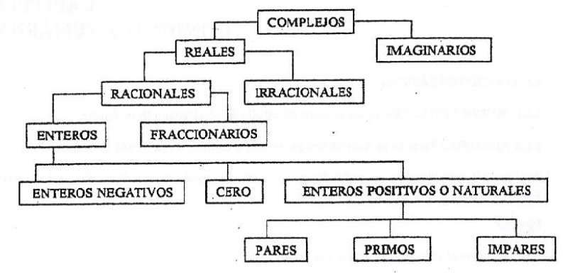

# NÚMEROS REALES

**Tema de la clase**  NÚMEROS REALES: Clasificación, Definición, Axiomas de cuerpo y operaciones. 

**Objetivo de la clase** Definir, conocer y resolver ejercicios con números reales.

## Clasificación de los numeros

## Numeros Naturales $N$

Surgen del proceso de contar
$N$={1,2,3,4,5,6,7,...}

En el conjunto de numeros naturales existen dos operaciones: suma y multiplicación.

A los numeros naturales $N$, se  les conoce tambien como los enteros positivos $Z^+$

**Numeros primos:** Un numero es primo si y solo si sus unicos factores son exactamente 1 y el mismo numero como: 2,3,5,7,11,13,17,19,...

## Numeros enteros $Z$

$Z$={...,-4,-3,-2,-1,0,1,2,3,4...}

Conformado por:

Numeros negativos: $Z^-$
Cero {0}
Numeros positivos o naturales $Z^+$

Los numeros enteros son cerrados respecto a la suma, multiplicación y sustracción; es decir el resultado de estas operaciones es siempre otro entero.

** Representación de un numero par:** $2n$:  ** Representación de un numero impar positivo y negativo:** $2n+1$ y  $2n-1$, cuando $n Є Z$

## Numeros racionales $Q$
Son de la forma: $\frac{p}{q}$, donde $q≠0$  y  $p ˄ q$  $Є Z$

Los numeros racionales son cerrados respecto a la suma, resta, multiplicación y divisón; es decir el resultado de estas operaciones es siempre otro racional, la unica operación no permitida es la divisón entre cero.

### Ejemplo 

- $-\frac{7}{5}$
- $4=\frac{4}{1}$
- $0=\frac{0}{1}$,
- $0.5=\frac{1}{2}$
- $0,333333...=\frac{1}{3}$
- $3,144444...=\frac{283}{90}$

De aqui se deduce:

- Todo entero es racional: $2=\frac{2}{1}$ 
- Los numeros decimales exactos o finitos son racionales:  $0.4=\frac{2}{5}$, $0.25=\frac{1}{4}$, $-0.08=- \frac{2}{25}$
- Los numeros decimales periodicos son racionales:  $2.55555...=\frac{23}{9}$,  $3.14444...=\frac{283}{90}$

## Numeros Irracionales $Q'$ o $I$

Se llaman tambien cantidades inconmensurables, son decimales no periodicos con un numero infinito de digitos que no se pueden expresar en forma de fracción.

### Ejemplos

- $π= 3.141592654$
- $\sqrt{2}=1.414213562$

## Numeros Reales $R$,  $R= Q ∪ I$

Los numeros reales es el conjunto formado por los subconjuntos de números racionales y los números irracionales, es decir es la unión de estos. 

**Axiomas de Igualdad**

$⍱$ $a$, $b$ y $c$ $Є R$ 

- **Simetrico:** Si $a=b$ $→$ $b=a$ 
- **Tansitivo:** Si $a=b$ $˄$ $b=c$  $→$ $a=c$

- **Reflexivo:** Si $a=a$

## Operaciones con numeros Racionales.

Cuando no existen signos de Agrupación se opera siguiendo el siguiente orden de prioridad de las operaciones de derecha a izquierda:

1. La multiplicación.
2. La divisón
3. La suma 
4. La resta 

### Ejemplos

- $20-5*3+2$

    $20-15+2$

    $5+2$

    $7$

- $16+40÷8-4*2$

    $16+40÷8-8$

    $16+5-8$

    $21-8$

    $13$

 - $\frac{4}{9}*(-2)-1÷\frac{3}{2}-(\frac{5}{18}-\frac{2}{3})*\frac{3}{2}+\frac{4}{3}÷-1$
 
 $-\frac{8}{9}-\frac{2}{3}-(\frac{5}{18}-\frac{12}{18})*\frac{3}{2}-\frac{4}{3}$
 
 $-\frac{8}{9}-\frac{2}{3}+ \frac{7}{18}*\frac{3}{2}-\frac{4}{3}$
 
 $-\frac{8}{9}-\frac{2}{3}+ \frac{7}{18}*\frac{3}{2}-\frac{4}{3}$
 
 $-\frac{8}{9}-\frac{2}{3}+ \frac{21}{36}-\frac{4}{3}$
 
 $\frac{-32-24+21-48}{36}$
 
 $-\frac{83}{36}$

-  $\frac{1.22222...÷(4-\frac{1}{3})+0.5555...*5÷\frac{5}{3}}{(2.6666....-1.6)(0,808080...-0.4444...+\frac{1}{11})*\frac{11}{3}}$

$\frac{\frac{11}{9}*\frac{3}{11}+\frac{5}{9}*5*\frac{3}{5}}{(\frac{24}{9}-\frac{8}{5})(\frac{80}{99})-\frac{4}{9}+ \frac{1}{11}*\frac{11}{3}}$

$\frac{\frac{1}{3}*\frac{5}{3}}{(\frac{48}{45})(\frac{45}{99}*\frac{11}{3}}$

$\frac{\frac{2}{1}}{\frac{16}{9}}$

$\frac{9}{8}$

## Bibliografía

- SILVA,José. 2011. ***Algebra***.

- García García, Juan Ignacio; García Sánchez, Pedro A; Urbano Blanco, Juan Manuel, [Fundamentos lógicos de la programación](http://hdl.handle.net/10481/43278), Universidad de Granada.

## Tarea en casa

Pagina 5. Ejercicios de Refuerzo.

