# Teoria de Conjuntos

**Tema de la clase**  Operaciones con conjuntos: unión, intersección, diferencia, diferencia simétrica y complemento. Ejercicios y problemas. 

**Objetivo de la clase** Define  y reconoce las características de las operaciones con conjuntos como la unión, intersección, diferencia, diferencia simétrica y complemento.               

## Operacion con cojuntos

1. **Unión ( $∪$ ):** La union de los conjuntos A y B es el conjunto formado por todos los elementos de A y todos ls elementos de B.

    Se denota por: $A ∪ B$ y se lee "A union B"

    Representación grafica de la union cuando A y B son conjuntos no disjuntos que es la parte sombreada de la figura.

    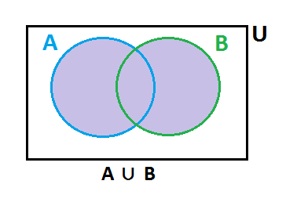

    Representación grafica de la union cuando A y B son conjuntos disjuntos que es la parte sombreada de la figura.

    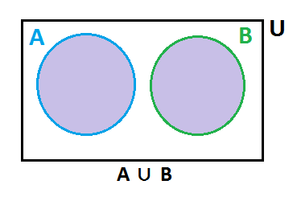

2. **Intersección ( $∩$ ):** La interseccion de los conjuntos A y B es el conjunto formado por todos los elementos comunes al conjunto A y al conjunto B.

    Se denota por: $A ∩ B$ y se lee "A intersección B"

    Representación grafica de la intersección cuando A y B son conjuntos no disjuntos que es la parte sombreada de la figura.

    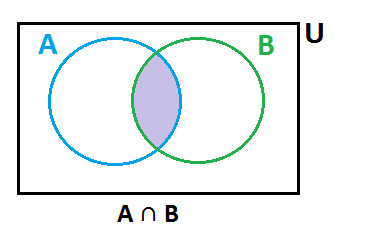

    Representación grafica de la interseccion  cuando A y B son conjuntos disjuntos. 

    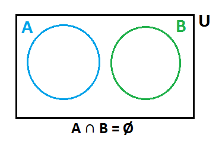

3. **Diferencia de Conjuntos ($-$ ó $∖$):**  La diferencia  de los conjuntos A y B es el conjunto de elementos que pertenecen a A, pero que no pertenecen a B.

    Se denota por: $A - B$ ó $A∖B$ y se lee "A menos B"

    Representación grafica de la diferencia cuando A y B son conjuntos no disjuntos que es la parte sombreada de la figura.

    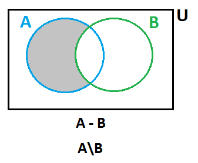

    Representación grafica de la interseccion  cuando A y B son conjuntos disjuntos
    que es la parte sombreada de la figura.

    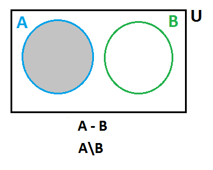

4. **Complemento de un Conjunto $'$ ó $^c$ :** El complemento de un conjunto A es el conjunto de elementos que no pertenencen al conjunto A, es decir la diferencia  del conjunto universal U y el conjunto A. 

    Se denota por: $A'$ ó $A^c$ y se lee "complemento de A"

    En forma simbolica $A^c= U - A$

    Representación grafica del complemento de A que es la parte sombreada de la figura.

    

5. **Diferencia de Simetrica de conjuntos ( $∆$ ):** Sean los conjuntos A y B dos subcojuntos de U.

    Se denota por: $A ∆ B$ y se lee "La diferencia simetrica de A y B"

    Y se define por: 
    $A ∆ B = (A ∪ B)-(A ∩ B)$  ó 
    $A ∆ B = (A - B) ∪ (B - A)$

    Representación grafica de la diferencia simetrica de A y B que es la parte sombreada de la figura. 

    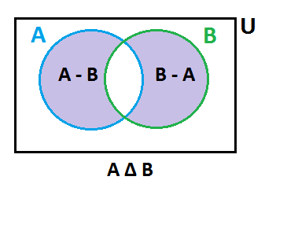

## Ejemplo 
Dados los conjuntos A={5,6,7,8} B={6,7,1,2}, C={4,5,7,9} y U={1,2,3,4,5,6,7,8,9,10} calcular :

Representacion grafica del ejercicio.

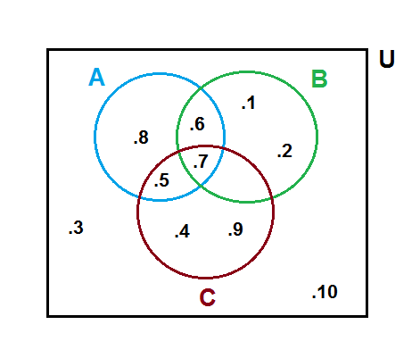

- $A ∪ B$= {1,2,5,6,7,8}

    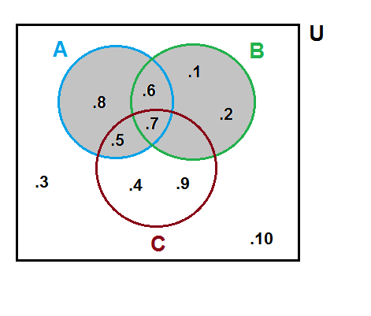

- $A ∩ B$= {6,7}

    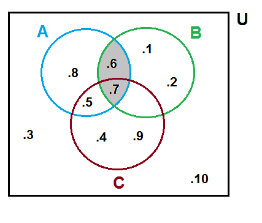

- $A - B$= {5,8}

    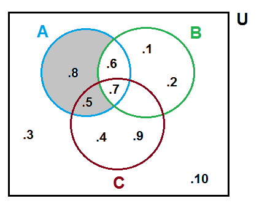

- $B - A$= {1,2}

    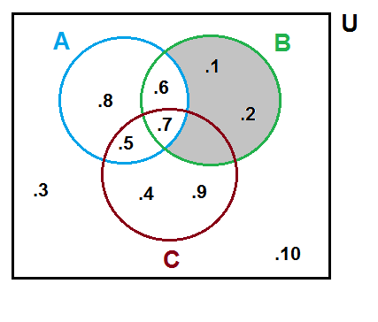

- $A^c = U - A$= {1,2,3,4,9,10}

    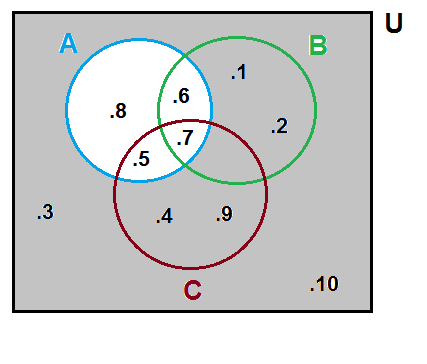

- $B^c = U - B$= {3,4,5,8,9,10}

    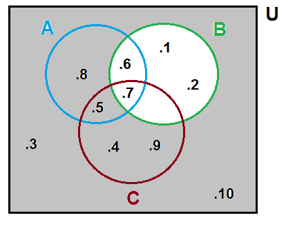

- $A ∆ B = (A ∪ B)-(A ∩ B)$= {1,2,5,8} ó $A ∆ B = (A - B) ∪ (B - A)$= {1,2,5,8} que es lo mismo.

    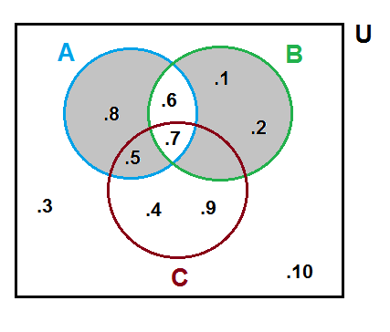

- $(A ∪ B)'= U- (A ∪ B)$= {3,4,9,10}

    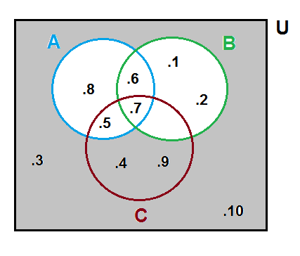

- $(A ∪ B) ∩ C$= {5,7} 

    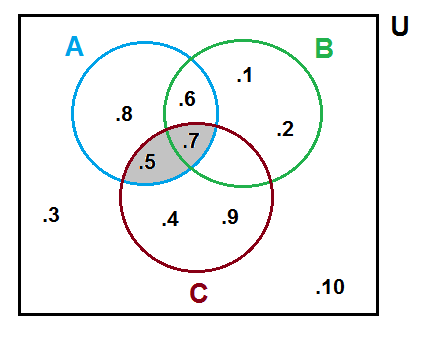

- $(A ∆ B)-C$= {1,2,8}

    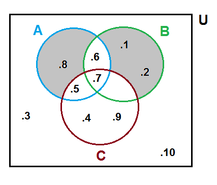

- $(A ∩ B ∩ C)$= {7}

    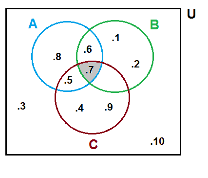

- $A ∩ C$= {5}

    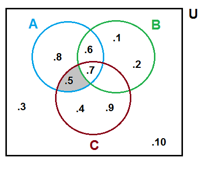

- $B ∩ C$= { }

    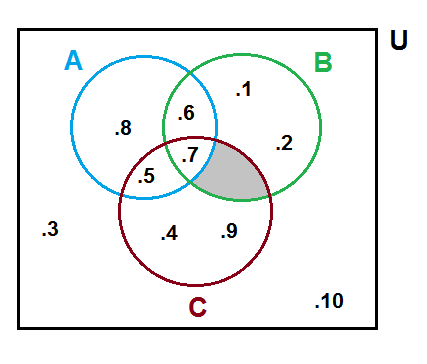

-  $(A ∪ B ∪ C)$= {1,2,4,5,6,7,8,9}

    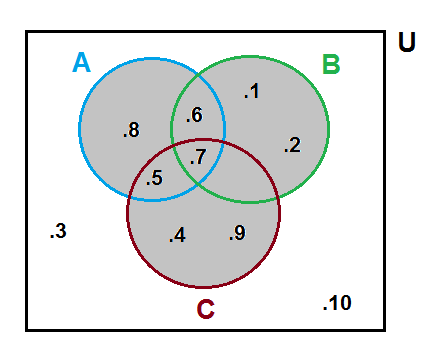

- $(A ∪ B ∪ C)'= U - (A ∪ B ∪ C)$ = {3,10}

    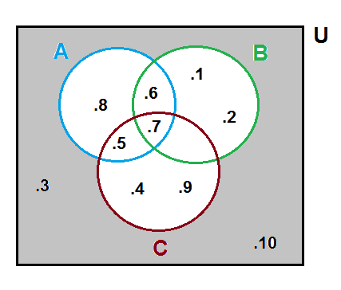

- Una persona come platano o naranja cada mañana durante el mes de marzo, si come naranja 25 mañanas y platano 18 mañanas. Cuantas mañanas come platano y naranjas. 

    Representacion grafica del ejercicio 

    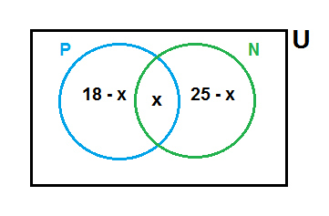

    P={mañanas que comen platanos}

    $n$P=18

    N={mañanas que comen naranjas}

    $n$N=25

    x={mañanas que comen platanos y naranajas}

    El universo es U={dias del mes de marzo}.

    $n$U=31

    Se plantea un sistema de ecuaciones de primer grado donde $A ∪ B= U$ ya que no existe personas que no coman ninguno de las dos brutas.

    $18 - x + x + 25 - x= 31$

    $43 - x= 31$

    $x=12$

    Entonces $12$ mañanas comen platano y naranja.

    Resolución grafica del Ejercicio.

    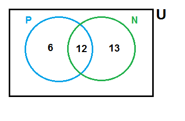

    Comprobación

    $6+12+13=31$

    $31=31$

- En una investigacion trabajan 67 personas. De estas 47 conocen el ingles, 35 el aleman y 23 ambos idiomas. Cuantas personas en el instituto no conocen el ingles ni el aleman.

    Representacion grafica del ejercicio 

    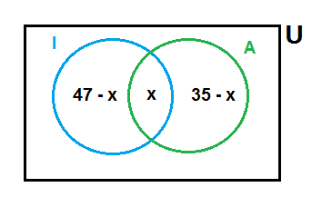

    I={personas que conocen el ingles}

    $n$P=47

    A={personas que conocen el aleman}

    $n$N=35

    x={personas que conocen ambos idiomas}

    x=23

    El universo es U={total de personas que trabajan en la investigación}.

    $n$U=67

    Reemplazando el valor de x: 

    

    Sumaremos estas cantidas 

    $24+23+12=59$

    Y para saber cuantas personas no conocen ni ingles ni aleman lo restaremos del conjunto universo.

    $67-59=8$

    Entonces $8$  personas no conocen ni ingles ni aleman.

    Resolución grafica del Ejercicio.

    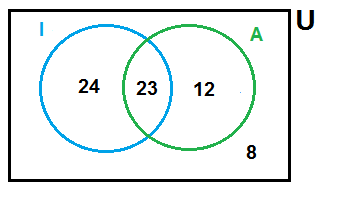
    
    Comprobación

    $24+23+12+8=67$

    $67=67$

- En una investigación realizada a un grupo de 100 personas que estudiaban varios idiomas se obtuvieron los siguientes resultados.

    Español= 28

    Aleman= 30

    Frances= 42

    Español y Aleman= 8

    Español y Frances= 10

    Aleman y Frances= 5 

    Y los tres idiomas= 3

    1. Cuantos alumnos no estudiaban idiomas
    2. Cuantos alumnos tenian como frances el unico idioma de estudio.

    Representación grafica del ejercicio.

    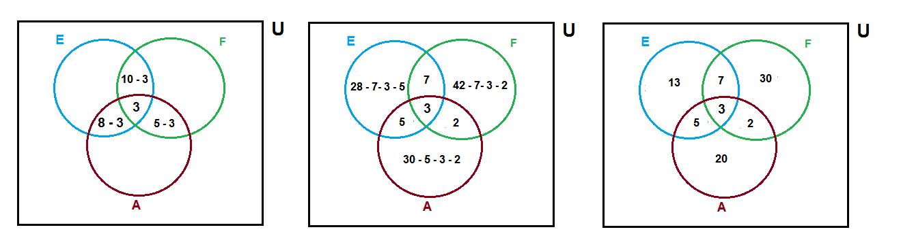

    Sumaremos estas cantidas 

    $13+5+3+7+20+2+30=80$

    Y para saber cuantas personas no estudian idiomas restaremos del conjunto universo.

    $100-80=20$

    Entonces $20$  personas no estudian idiomas y $30$ solo Frances.

    Resolución grafica del Ejercicio.

    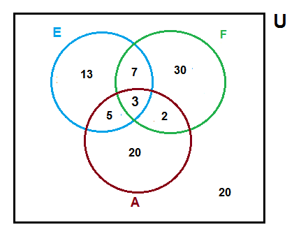

    Comprobación

    $13+5+3+7+20+2+3+20=100$

    $100=100$

## Bibliografía

- ESPINOZA,Eduardo. 2005. ***Matemática Básica***. Perú:Lima.

- [Conjuntos, relaciones y aplicaciones](https://cursos-0-fc-ugr.github.io/Matematicas/00-conjuntos.html), de los [Cursos Cero](https://cursos-0-fc-ugr.github.io/) de [Matematicas](https://cursos-0-fc-ugr.github.io/Matematicas/)  la Facultad de Ciencias de la Universidad de Granada.

## Tarea en casa

Página 133. Ejercicios 61,67 del Libro Matemática Básica.

