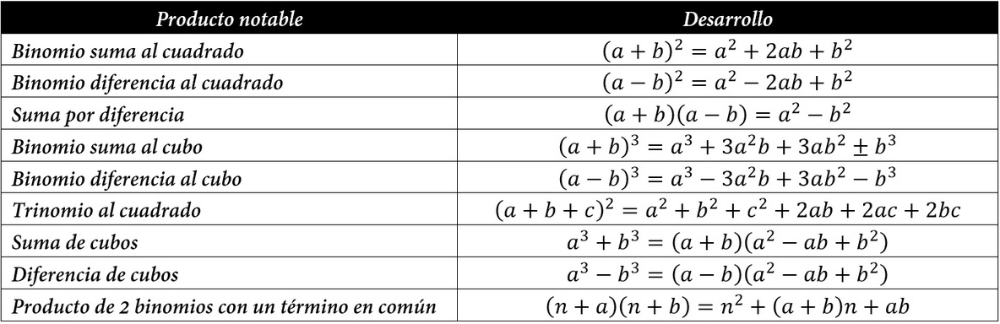

# Expresiones Algebraicas

**Tema de la clase** Operaciones con expresiones algebraicas: suma, resta, multiplicación y productos notables.

**Objetivo de la clase**  Resolver ejercicios con expresiones algebraicas como:  suma, resta, multiplicación y productos notables.

## Operaciones con Polinomios

La  adición y sustraccion de polinomios se realiza considerando terminos semejantes.

## Suma Algebraica 

Para sumar polinomios debemos sumar los coeficientes de asociados a una misma potencia de $x$, es decir:

- Sean: $P_1(x)=(-10 x^4 - 3 x^2 + 2 x - 2) ; P_2(x)=(x^3 + x^2 + x + 1)$.

    Hallar $P(x)=P_1(x)+P_2(x)$

    $P(x)=P_1(x)+P_2(x)$

    $P(x)=(-10 x^4 - 3 x^2 + 2 x - 2)+ (x^3 + x^2 + x + 1)$

    $P(x)=(-10 + 0) x^4 + (0 + 1) x^3 + (-3 + 1) x^2 + (2 + 1) x + (-2 + 1)$

    $P(x)= -10 x^4 + x^3 -2 x^2 + 3 x - 1$

- Sean: $P_1(x)=(\dfrac{5}{2}x^5 - 2 x^4 - 3 x^3 - 3 x^2 + \dfrac{1}{2}) ; P_2(x)=(\dfrac{3}{2}x^5 -3 x^2 +3x -4)$.

    Hallar $P(x)=P_1(x)+P_2(x)$

    $P(x)=P_1(x)+P_2(x)$

    $P(x)=(\dfrac{5}{2}x^5 - 2 x^4 +7 x^3 -3 x^2 + x + \dfrac{1}{2}) + (\dfrac{3}{2}x^5 + 3 x^2 + 11x -4)$

    $P(x)=(\dfrac{5}{2} +\dfrac{3}{2} ) x^5+ (-2 + 0) x^4 + (7 + 0) x^3 + (-3 + 3 ) x^2 + (1 + 11) x + (\dfrac{1}{2} -4)$

    $P(x)= 4 x^5 - 2 x^4 + 7  x^3 + 12 x - \dfrac{7}{2}$

- Sean: $P_1(x)=(-x^4 + 4 x^2 - 2 x ) ; P_2(x)=(x^3 - 2 x^2 - x - 1)$.

    Hallar $P(x)=P_1(x)+P_2(x)$

    $P(x)=P_1(x)+P_2(x)$

    $P(x)=(-x^4 + 4 x^2 - 2 x ) + (x^3 - 2 x^2 - x - 1)$

    $P(x)=(-1 + 0) x^4 + (0 + 1) x^3 + ( 4 - 2) x^2 + (-2 - 1) x + (0 - 1)$

    $P(x)= - x^4 + x^3 + 2 x^2 - 3 x - 1$

## Resta Algebraica 

La resta de polinomios consiste en sumar al minuendo el opuesto del sustraendo, es decir, el polinomio que esta despues del signo $(-)$ se le tiene que cambiar los signos de cada termino y se procede de igual forma que en la suma.

- Sean: $P_1(x)=(-10 x^4 - 3 x^2 + 2 x - 2) ; P_2(x)=(x^3 + x^2 + x + 1)$.

    Hallar $P(x)=P_1(x)-P_2(x)$

    $P(x)=P_1(x)-P_2(x)$

    $P(x)=(-10 x^4 - 3 x^2 + 2 x - 2)- (x^3 + x^2 + x + 1)$

    $P(x)=(-10 x^4 - 3 x^2 + 2 x - 2)+ (-x^3 - x^2 - x - 1)$

    $P(x)=(-10 + 0) x^4 + (0 - 1) x^3 + (-3 - 1) x^2 + (2 - 1) x + (-2 - 1)$

    $P(x)= -10 x^4 - x^3 -4 x^2 +  x - 3$

- Sean: $P_1(x)=(\dfrac{5}{2}x^5 - 2 x^4 - 3 x^3 - 3 x^2 + \dfrac{1}{2}) ; P_2(x)=(\dfrac{3}{2}x^5 -3 x^2 +3x -4)$.

    Hallar $P(x)=P_1(x)-P_2(x)$

    $P(x)=P_1(x)-P_2(x)$

    $P(x)=(\dfrac{5}{2}x^5 - 2 x^4 +7 x^3 -3 x^2 + x + \dfrac{1}{2}) - (\dfrac{3}{2}x^5 + 3 x^2 + 11x -4)$

    $P(x)=(\dfrac{5}{2}x^5 - 2 x^4 +7 x^3 -3 x^2 + x + \dfrac{1}{2}) + (-\dfrac{3}{2}x^5 - 3 x^2 - 11x + 4)$

    $P(x)=(\dfrac{5}{2} - \dfrac{3}{2} ) x^5+ (-2 + 0) x^4 + (7 + 0) x^3 + (-3 - 3 ) x^2 + (1 - 11) x + (\dfrac{1}{2} + 4)$

    $P(x)=  x^5 - 2 x^4 + 7  x^3 - 6  x^2 - 10 x + \dfrac{9}{2}$

- Sean: $P_1(x)=(-x^4 + 4 x^2 - 2 x ) ; P_2(x)=(x^3 - 2 x^2 - x - 1)$.

    Hallar $P(x)=P_1(x)-P_2(x)$

    $P(x)=P_1(x)-P_2(x)$

    $P(x)=(-x^4 + 4 x^2 - 2 x ) - (x^3 - 2 x^2 - x - 1)$

    $P(x)=(-x^4 + 4 x^2 - 2 x ) + (-x^3 + 2 x^2 + x + 1)$

    $P(x)=(-1 + 0) x^4 + (0 - 1) x^3 + ( 4 + 2) x^2 + (-2 + 1) x + (0 + 1)$

    $P(x)= - x^4 - x^3 + 6 x^2 - x + 1$

## Multiplicación de Polinomios.

Para multiplicar Polinomios se emplea el producto de potencias de igual base, es decir, $x^m * x^n = x^{m+n}$.  De esta forma la multiplicación se realiza usando la propiedad distributiva y el producto de cada monomio.

**Producto monomio por monomio**

- $(-3 x^3)  (13 yx^2)$

    $(-3.13) x^{3+2} y$

    $-39 x^5 y$

- $\left(\dfrac{1}{3} xy^2z^4 \right) (7x^3 y^5 z^4)$ 

    $\left (\dfrac{1}{3} . \dfrac{7}{1} \right) x^{1+3} y^{2+5} z^{4+4}$

    $\dfrac{7}{3} x^{4} y^{7} z^{8}$ 

**Producto monomio por binomio**

- $(3 x^2) (4 y^3x^4- 8 xy)$

    $(3x^2)(4 y^3x^4) - (3 x^3) ( 8 xy)$

    $12x^6y^3-24 x^4y$

- $\left(\dfrac{1}{3} xy^2z^5 \right) \left(-\dfrac{5}{2}x^2z^4 + 8 y^3 \right)$

    $\left(\dfrac{1}{3} xy^2z^5 \right) \left(-\dfrac{5}{2}x^2z^4 \right) + \left(\dfrac{1}{3} xy^2z^5 \right)  (8 y^3)$

    $-\dfrac{5}{6} x^3y^2z^9 + \dfrac{8}{3} xy^5z^5$

**Binomio por Trinomio**

- Sean: $P_1(x)=(-10 x^2- 3 x -2) ; P_2(x)=(x - 2)$.

    Hallar $P(x)=P_1(x) * P_2(x)$

    $P(x)=P_1(x)* P_2(x)$

    $P(x)=(-10 x^2- 3 x -2) * (x + 2$

    $P(x)=(-10 x^2- 3 x -2) * (x) - (-10 x^2- 3 x -2) * (2)$

    $P(x)=-10 x^3- 3 x^2 -2x + 20 x^2 +  2 x + 4$

    terminos semejantes

    $P(x)=-10 x^3 + 17 x^2 + 4$

- Sean: $P_1(x)=(3 x^2 + x +5) ; P_2(x)=(x^2 - 3x)$.

    Hallar $P(x)=P_2(x) * P_1(x)$

    $P(x)=P_2(x)* P_1(x)$

    $P(x)=(x^2 -3x) * (3 x^2 +x + 5)$

    $P(x)=(x^2)(3 x^2 +x + 5) - (3x) (3 x^2 +x + 5)$

    $P(x)=3 x^4 + x^3 + 5 x^2 - 9 x^3 - 3 x^2 - 15x$
    
    terminos semejantes

    $P(x)= 3x^4 -8 x^3 + 2x^2 -  15x$

**Producto de Polinomios**

- Multiplicar $x^{a+2}- 3 x^{a} - x^{a+1} + x^{a-1}$  por   $x^{a+1} + x^{a} + 4 x^{a-1}$

    $(x^{a+2}) (x^{a+1} + x^{a} + 4 x^{a-1})- (3 x^{a}) (x^{a+1} + x^{a} + 4 x^{a-1}) - (x^{a+1}) (x^{a+1} + x^{a} + 4 x^{a-1})+ (x^{a-1}) (x^{a+1} + x^{a} + 4 x^{a-1})$

    $(x^{a+2+a+1} + x^{a+2+a} + 4 x^{a+2+a-1})- (3x^{a+a+1} + 3 x^{a+a} + 12 x^{a+a-1}) - (x^{a+1+a+1} + x^{a+1+a} + 4 x^{a+1+a-1})+ (x^{a-1+a+1} + x^{a-1+a} + 4 x^{a-1+a-1})$

    $(x^{2a+3} + x^{2a+2} + 4 x^{2a+1})- (3x^{2a+1} + 3 x^{2a} + 12 x^{2a-1}) - (x^{2a+2} + x^{2a+1} + 4 x^{2a})+ (x^{2a} + x^{2a-1} + 4 x^{2a-2})$

    Eliminar parentesis utilizando la ley de los signos.

    $x^{2a+3} + x^{2a+2} + 4 x^{2a+1}- 3x^{2a+1} - 3 x^{2a} - 12 x^{2a-1} - x^{2a+2} - x^{2a+1} - 4 x^{2a}+ x^{2a} + x^{2a-1} + 4 x^{2a-2}$

    Terminos semejantes.

    $x^{2a+3} - 6 x^{2a} - 11 x^{2a-1}  + 4 x^{2a-2}$

## Productos Notables 

Son aquellos productos cuyo resultado se pueden obtener directamente sin efectuar la operación (multiplicacion de polinomios), lo mas comunes son: 

### Ejemplo

- $(2 x^3 - \dfrac{1}{3}y)^{2}=(2 x^3)^{2} - 2(2 x^3 )(\dfrac{1}{3}y) + (\dfrac{1}{3}y)^{2}$

    $(2 x^3 - \dfrac{1}{3}y)^{2}=4 x^6 - \dfrac{4}{3}x^3y + \dfrac{1}{9}y^{2}$

- Realizando la multiplicación de polinomios se obtiene el mismo resultado:

    $(2 x^3 - \dfrac{1}{3}y)^{2}= (2 x^3 - \dfrac{1}{3}y) * (2 x^3 - \dfrac{1}{3}y)$

    $(2 x^3 - \dfrac{1}{3}y)^{2}= (2 x^3) (2 x^3) + (2 x^3) (\dfrac{1}{3}y) - (\dfrac{1}{3}y) (2 x^3) + (\dfrac{1}{3}y)   (\dfrac{1}{3}y)$

    $(2 x^3 - \dfrac{1}{3}y)^{2}=4 x^6 - \dfrac{2}{3}x^3y - \dfrac{2}{3}x^3y + \dfrac{1}{9}y^{2}$

    $(2 x^3 - \dfrac{1}{3}y)^{2}=4 x^6 - \dfrac{4}{3}x^3y + \dfrac{1}{9}y^{2}$
 
## Bibliografía

- SILVA,José. 2011. ***Algebra***.

- García García, Juan Ignacio; García Sánchez, Pedro A; Urbano Blanco, Juan Manuel, [Fundamentos lógicos de la programación](http://hdl.handle.net/10481/43278), Universidad de Granada.

## Tarea en casa

Pagina 22. Ejercicio de Refuerzo  de la 11 a a 14.

