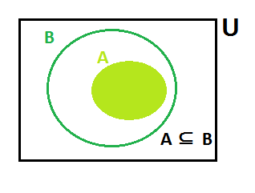

# Teoria de Conjuntos

**Tema de la clase**  Clasificación de conjuntos: por las relaciones entre sí y por el número de elementos. Diagrama de Venn. Número de elementos de un conjunto finito. Conjunto potencia. 

**Objetivo de la clase** Representar gráficamente un conjunto mediante figuras geométricas y conocer la clasificación según sus elementos.  

## Clasificación de los conjuntos

- **Conjunto Finito:** Conjunto formado por un número limitado de elementos.

    - B={$x/x$ es una vocal}.
    - C={$x ∈ N$ / $5< x < 12$}
    - D={$x/x$ es un dia de la semana}

- **Cojunto Infinito:** Conjunto formado por un numero infinito de elementos.

    - H={$x ∈ Z$ / $x$  es  par}.

    - I={$x ∈ Z$ / $x$ es impar}.

    - M={$x/x$ es un número entero}.

- **Cojunto Unitario:** Conjunto con un solo elemento.

    - J={$x ∈ N$/ $1 < x < 3$ }.
    
        J={2}
   
   -  K={$x ∈ Z^+$ / $x^2-1=0$ }.

        K={1}
    
    - N={$x ∈ R$ / $x+2=0$ }.
    
        N={-2}
    

- **Cojunto Vacio:** Conjunto que no tiene elementos.

    - L={$x ∈ N$/ $1 < x < 2$ }.

        L={  }  $ó$  L=∅

    - O={$x ∈ R$/ $x^2+1=0$ }. No tiene raices reales.

        O={  } 

    - P={$x ∈ Z$/ $15x^2-11x+2=0$}. No tiene raices enteras.

        P={  }

- **Conjunto Universo:**
    Es el conjunto tomado como base o cojunto fijo, para la determinacion de otros conjuntos que seran subcojuntos del universal y se denota por $U$. 

    - El conjunto universal U={$x ∈ Z$/ $-2 < x < 10$} es el universo de los conjuntos A={-3.0.2.5}, B={-2,1,3,7}, C={-1,0,2,5,8} porque todos los elementos de los conjutnos A,B y C pertenecen al conjunto U.

    - Dado el conjunto U={$x ∈ Z^+$ / $x<41$ }. Determinar:

        A={$x$ / $x^2 < 29$ }.

        El conjunto U={1,2,3,4,5,6,...,39,40}  y A={1,2,3,4,5} por que:

        $1∈ A$ puesto que $1^2= 1 <29$.

        $2 ∈ A$ puesto que $2^2= 4 <29$.

        $3∈ A$ puesto que $3^2= 9 <29$.

        $4∈ A$ puesto que $4^2= 16 <29$.

        $5∈ A$ puesto que $5^2= 25 <29$.

        $6∈ A$ puesto que $6^2= 36$   no  es menor que $29$.

## Representación grafica de los conjuntos.

Como ya conocemos utilizaremos los diagramas de Venn-Euler para representar los conjuntos. Al cojunto universal se lo representa generalmente por medio de un rectangulo y a los subcojuntos con circunferencias.

## Cardinalidad de un conjunto

Es el numero de elementos de los que consta un conjunto y se denota como: 

$n$(nombre del conjunto).

### Ejemplo

- A={a,e,i,o,u}

    $nA$=5

- B={$x ∈ N$/ $1 < x <9$}

    $nB$=7

- C={$x ∈ Z^+$/ $x < 18 $}

    $nC$=17

## Conjunto potencia

Dado el conjunto A, llamaremos conjunto potencia de A al cojunto formado por todos los subcojuntos de A incluyendo al cojunto vacio ∅.

Al cojunto potencia de A denotaremos por P(A) y se expresa como:

P(A)={$x$/$x ⊆ A$} 

Se determina mediante la expresión $2^n$ donde $n$ es el numero de elementos del conjunto A

### Ejemplo
Dado los siguientes conjuntos determinar el cojunto potencia de cada uno de ellos.

- B={a,b}

    $n=2$

    Elementos de P(B)= $2^2=4$ ; entonces por extensión:

    P(B)={{a},{b},{a,b},{∅}}.

- C={1,2,3}

    $n=3$

    Elementos de P(C)= $2^3=8$ ; entonces por extensión:

    P(C)={{1},{2},{3},{1,2},{1,3},{2,3},{1,2,3},{∅}}.

## Bibliografía

- ESPINOZA,Eduardo. 2005. ***Matemática Básica***. Perú:Lima.

- García García, Juan Ignacio; García Sánchez, Pedro A; Urbano Blanco, Juan Manuel, [Fundamentos lógicos de la programación](http://hdl.handle.net/10481/43278), Universidad de Granada.

## Tarea en casa

Consultar: ¿Cuales son las operaciones entre conjuntos?

