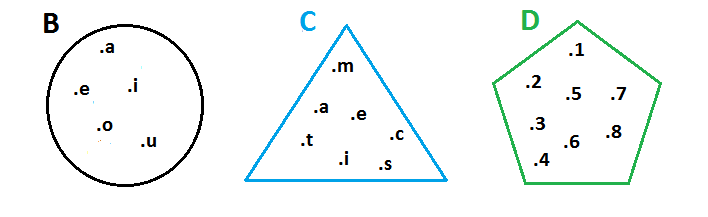
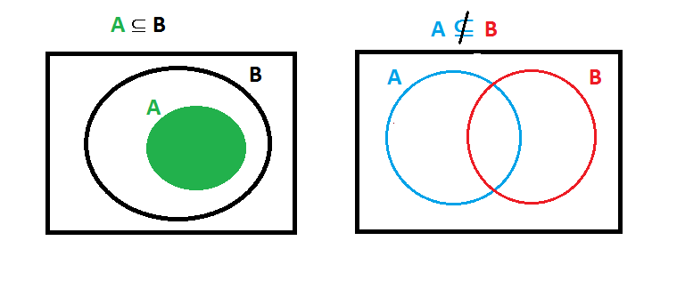

# Teoria de Conjuntos

**Tema de la clase**  Conjunto y elemento. Determinación de conjuntos: enumeración y comprensión. Relaciones entre conjuntos: igualdad, equivalencia y relación de inclusión.

**Objetivo de la clase** Definir y reconocer conjuntos y sus características para operar con ellos de forma algebraica.
## Definición 

Un conjunto es toda agrupación o recolección de objetos de cualquier especie siempre que exista un criterio preciso que nos permita determinar si un objeto pertenece o no a dicha agrupación. Los objetos que "pertenecen a un conjunto" se llaman elementos del conjunto.

Los conjuntos se representan con letras mayusculas como A,B,C... y a sus elementos con letras minnusculas a,b,c,...
Dentro de un conjunto no se pueden repetir sus elementos.

### Ejemplo 

- Expresar B como el conjunto formado por las vocales.

        B={a,e,i,o,u}

- Expresar C como el conjunto formado por las letras de la palabra matematicas.

        C={m,a,t,e,i,c,s}

- Expresar D como el conjunto formado por los numeros mayores o iguales que uno y menores o iguales que ocho.

        D={1,2,3,4,5,6,7,8}

## Relación de Pertenencia

Es el simbolo que relaciona a los elementos de un conjunto con el mismo conjunto y se lee:
 - $∈$ "pertenece al"
 - $∉$ "no pertenece al"

Si un objeto $x$ pertenece un conjunto B escribiremos.
- $x ∈ B$

Si un objeto $x$ no pertenece a un conjunto B escribiremos. 
- $x ∉ B$

### Ejemplo

De los ejemplos anteriores determinar si es verdadero o falso las siguientes relaciones de pertenencia. 

- $a ∈ B$   
Verdadero
- $p ∈ B$   
Falso
- $m ∈ C$   
Verdadero
- $t ∉ B$   
Verdadero
- $s ∉ C$   
Falso
- $9 ∉ D$   
Verdadero
- $7 ∈ D$   
Verdadero
- $5 ∉ D$   
Falso

## Diagrama de Venn-Euler
Los cojuntos pueden ser representados graficamente mediante diagramas de Venn que son curvas cerradas.

En el interior de estas curvas cerradas se escriben los elementos del conjunto.

### Ejemplo
Representacion mediante diagrama de Venn de los conjuntos B, C y D.

 
 
## Determinación de Conjuntos
Un conjunto se puede definir por extensión y por comprensión.

- **Por extensión:** Cuando se nombran cada uno de los elementos de un conjunto.
- **Por comprensión:** Cuando se da una propiedad P, que solo satisfacen a los elementos del conjunto.

### Ejemplo 
1. 
- **Por extensión:** B={a,e,i,o,u}.
- **Por comprensión:** B={$x/x$ es una vocal}. Y se lee "B es el conjunto de las $x$ tal que $x$ es una vocal"

2.

- **Por extensión:** D={1,2,3,4,5,6,7,8}. 
- **Por comprensión:** D={$x ∈ N$/ $1 ≤ x ≤ 8$ }. Y se lee " D es el conjunto de las $x$ perteneciente a los naturales tal que los $x$ sean mayores o iguales que uno y menores o iguales que ocho.
3.
- **Por comprensión:** E={$x ∈ N$/ $x$ es par y  $x < 9$ }.
- **Por extensión:** E={2,4,6,8}
4.

- **Por comprensión:** F={$x ∈ N$/ $x^2 = x$ }.
- **Por extensión:** F={1}

5.

- **Por comprensión:** G={$x^2$: $x ∈ N$ y $x < 5$ }.
- **Por extensión:** G={1,4,9,16}

6. 
- **Por comprensión:** M={$x ∈ N$/ $6x^3-31x^2+3x+10=0$ }.
- **Por extensión:** M={5}

7.
- **Por comprensión:** M={$x$/ $6x^2-5x+1=0$}.
- **Por extensión:** M={$\frac{1}{2}$ , $\frac{1}{3}$}

## Relación entre conjuntos.

**Inclusión de conjuntos:** Sub-conjuntos, se dice que el conjunto A es un subconjunto B, o que A esta contenido en B, si todo elemento de A pertence al conjunto  B y se escribe $A ⊆ B$ y se lee "A esta incluido en B".

Si A no es subcojunto de B se escribe $A ⊊ B$.

Representación grafica.

### Ejemplo

- Si A={1,3,5} y B={1,2,3,4,5,6,7} entonces $A ⊆ B$.

    Verdadero ya que todo elemento de A es tambien elemento de B.

- Consideremos los siguientes conjuntos M={a,b,c,d,e} y N={b,c,d,m,n}. Se puede afirmar que:

    $M ⊊ N$ por que algunos elementos de M no estan en N.

## Igualdad de Conjuntos 

Dos conjuntos A y B se dice que son iguales si y solo si $A ⊆ B$ y $B ⊆ A$.

Simbolicamente: 

$A=B ⇔ A ⊆ B $˄$ $B ⊆ A$

Se lee "El conjunto A es igual al conjunto B, si y solo si A esta contenido en B y B esta contenido en A"

### Ejemplo

- Sean los cojuntos A={a,b,c} y C={a,b,c}, se puede afirmar que $A=C$ porque $A ⊆ C$ y $C ⊆ A$

- Sean los cojuntos B={1,2,3,4,5} y D={1,2}, se puede afirmar que $B≠D$ porque $B ⊊ D$ y $D ⊆ B$.

## Bibliografía

- ESPINOZA,Eduardo. 2005. ***Matemática Básica***. Perú:Lima.

- [Conjuntos, relaciones y aplicaciones](https://cursos-0-fc-ugr.github.io/Matematicas/00-conjuntos.html), de los [Cursos Cero](https://cursos-0-fc-ugr.github.io/) de [Matematicas](https://cursos-0-fc-ugr.github.io/Matematicas/)  la Facultad de Ciencias de la Universidad de Granada.

## Tarea en casa

Página 80. Ejercicios 1,2,4,7 del Libro Matemática Básica.

 

